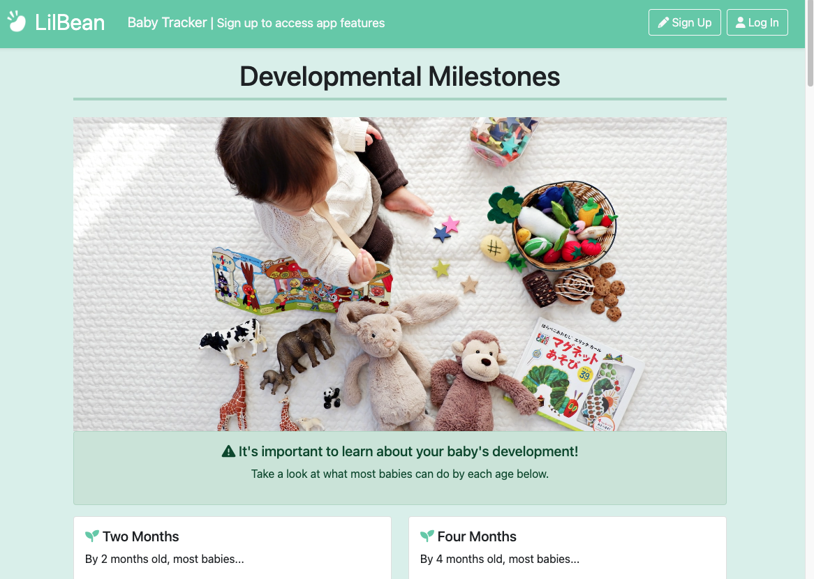
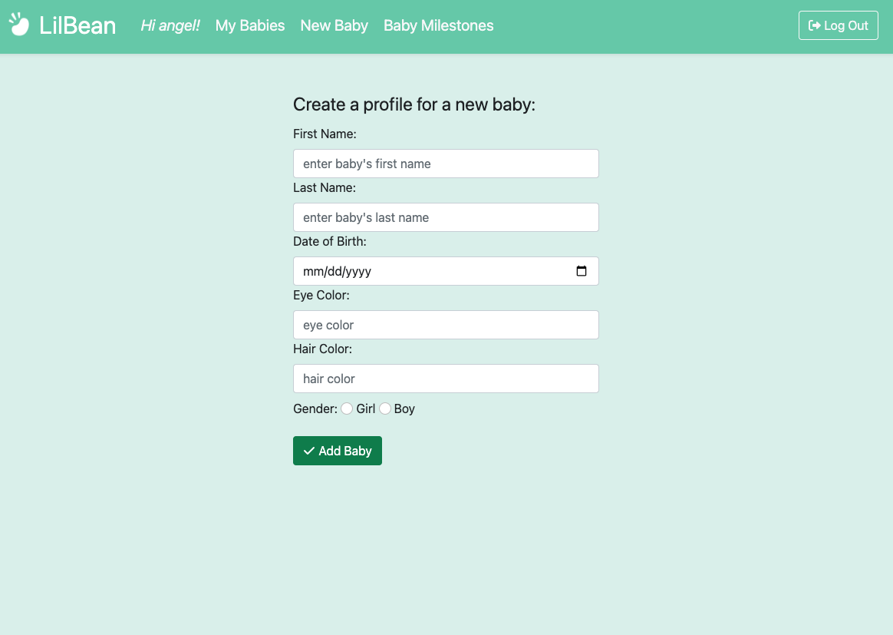
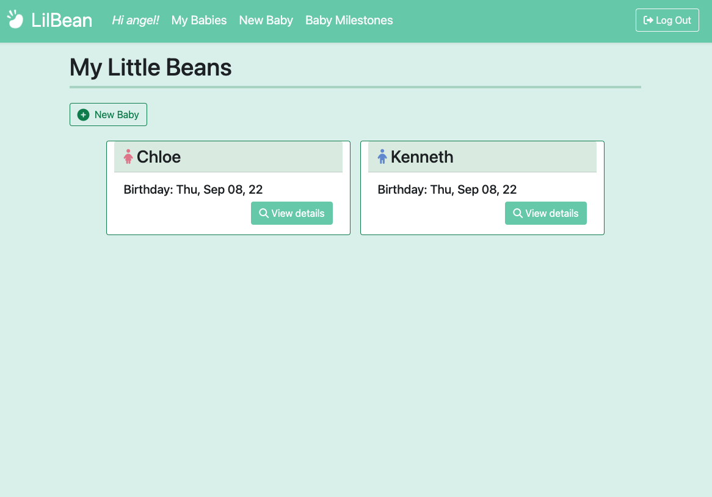
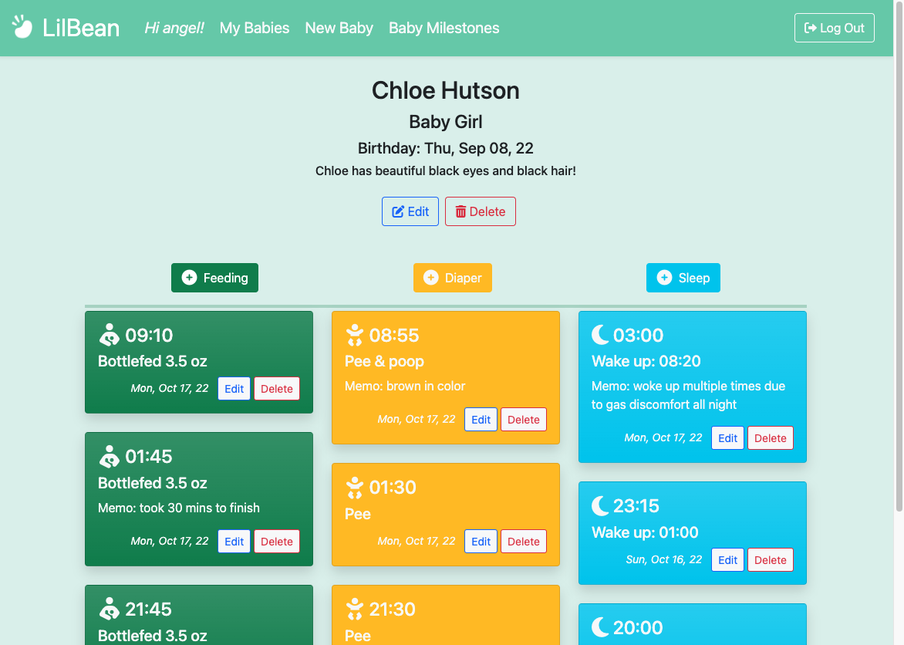
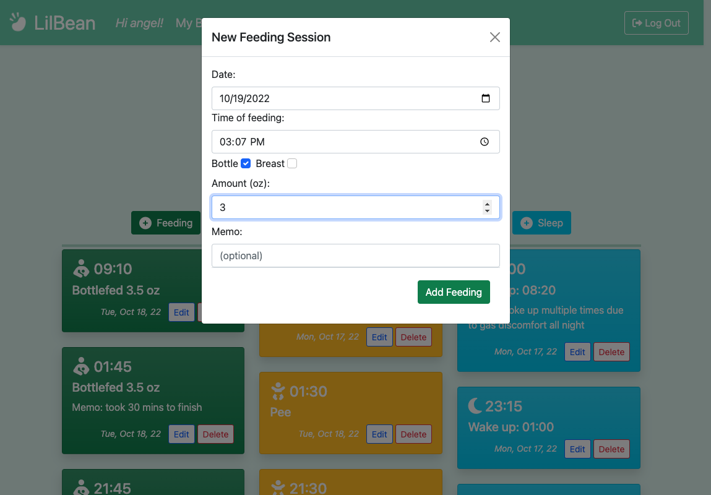

# LilBean Full-Stack Application

## OVERVIEW

This is a responsive baby tracker app for parents to log their baby's daily progress and events, including feedings, sleep, and diaper changes. It also provides information on important developmental milestones by age.

### Link
http://lilbeanapp.fly.dev

### Technology
- MongoDB
- Mongoose
- Express
- Liquid JS
- HTML5
- CSS & Bootstrap
- JavaScript

## INSTRUCTIONS
- Create an account with a username and password.
- Once logged in, you are able to add a new baby by completing the baby profile form. You can add as many babies as you please.
- Navigate to the 'My Babies' page and select the baby you want to add events for.
- You can log feedings, diaper changes, and/or sleep sessions by clicking on the corresponding buttons.
- Fill in the necessary details and add the event.
- You can edit/delete each event any time you desire.
- You can also edit an existing baby profile as well as delete it entirely. Note that deleting a baby profile will also delete all logged events for that baby.

## SCREENSHOTS & ENTITY RELATIONSHIP DIAGRAM







## RESTFUL ROUTES


## USER STORIES
```
As a user, I want the ability to...
- create an account
- sign in with a username and password
- sign out
- create a profile for my baby
- log feedings
- log sleep times
- log diaper changes
- view all my logs
- edit my logs 
- delete my logs
- add a memo to each log if desired
- delete the memo
- navigate the app using a navbar
```

## Credits

Image source: [Unsplash](https://unsplash.com/)


# lilBean Baby Tracker